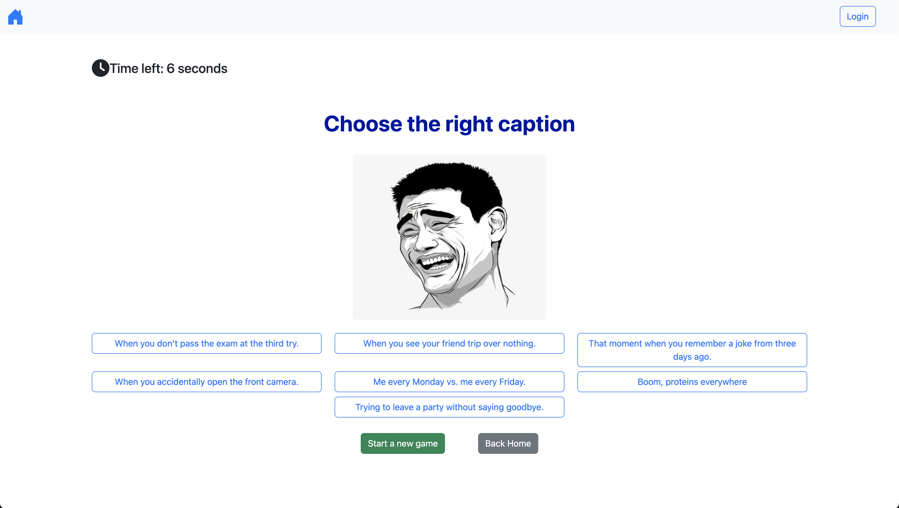
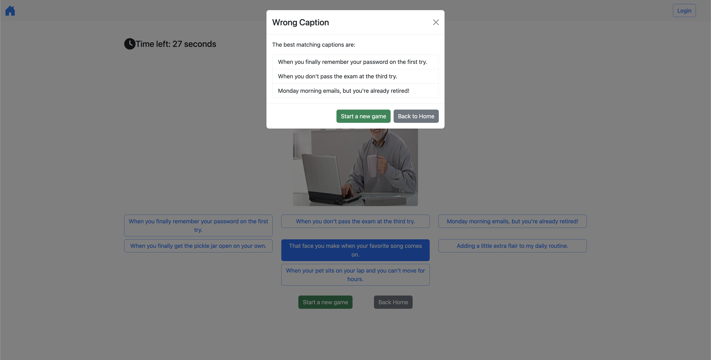

[](https://classroom.github.com/a/AVMm0VzU)
# Exam #1: "Meme Game"
## Student: s303903 DONADIO MATTEO 

## React Client Application Routes

- Route `/`: home page with the possibility of starting a new game
- Route `/newRound`: new round for non authenticated users
- Route `/newGame`: new game for authenticated users
- Route `*`: error route
- Route `/login` : login form


## Main React Components

- `Header` (in `Header.jsx`): contains the home button and login button
- `HistoryTable` (in `HomePage.jsx`): contains the history table for logged in users
- `NewGameButton` (in `HomePage.jsx`): button to start a new game
- `Round` (in `Round.jsx`): contains the meme pictures, the seven captions and the logic for playing a new round. Here a useEffect call the api for generating a new Meme
- `GameComponent` (in `GameComponent.jsx`): father component of Round for authenticated users. It contains the information of the 3 rounds of a single game and the useEffect for adding a new game.
- `NotFoundComponent` (in `NotFoundComponent.jsx`): Component for the wrong route.
- `LoginForm` (in `Authentication.jsx`): Login form for users.
- `App` in (`App.jsx`): father component of all components. It contains a useEffect for retrieving played games of a logged in user.
 


## API Server

### Add a new game
- **POST** `/api/games` - save a new game for the authenticated user
- Request Body: an object containing information about the game (id of the user, ids of the meme of the played games, score reached for each game (0 or 5)):
    ```json
    {
      "userId": 1,
      "meme_ids": [1, 2, 3],
      "rounds": [5, 0, 5]
    }
- Response 201: The game was successfully created.
- 400 Bad Request: The user ID provided does not exist.
- 500 Internal Server Error: There was an error on the server while processing the request.
- Example Successfully Response Body (201):
  ```json
  {
    "userId": 1,
    "meme_ids": [1, 2, 3 ],
    "rounds": [5, 0, 5],
  }
  ```


### Generate a random meme
- **GET** `/api/singleRound`: generate a random meme  
  - Parameters: None
  - Response body content: the response body includes a meme object that contains the meme ID, the meme URL, an array of matched captions, and an array of other random captions selected from a broader set. Each caption object typically contains an ID and the caption text.
  ```json
  {
    "id": 1,
    "url": "button.jpeg",
    "matching": [
      {
        "id": 10,
        "text": "Me avoiding responsibilities like..."
      },
      {
        "id": 11,
        "text": "When someone says there's cake in the break room but you're on a diet."
      }
    ],
    "other": [
      {
        "id": 40,
        "text": "That mini heart attack when you miss a step."
      },
      {
        "id": 43,
        "text": "When your crush says hi and you say 'good, you?'"
      },
      {
        "id": 26,
        "text": "When someone asks if you’re hungry and you just ate."
      },
      {
        "id": 15,
        "text": "That moment you realize you're a queen and the stage is your castle."
      },
      {
        "id": 12,
        "text": "When you hear someone say 'treat' from three rooms away."
      }
    ]
  }
- Response 200 : New meme successfully generated
- Response 404 : Meme not found
- Response 500: internal Server Error. 


### Retrieve all played games 
- **GET** `/api/playedGames`: retrieve a list of games played by the authenticated user.
- Request 
  - Parameters: None
  - Header: authentication token should be included to verify user identity.
- Response body content: the response body contains an array of game objects. Each game object includes the game ID, user ID, an array of meme URLs from the games played, and the scores for each round.
    ```json
    [
      {
        "id": 1,
        "userId": 1,
        "urls": ["dog.jpeg", "singer.jpeg", "toy_story.jpeg"],
        "rounds": [5,0,5]
      }
      ...
    ]
- Response 200 : successfully retrieved the list of games.
- Response 500: internal Server Error. It could be triggered if there's an error during retrieval of games or if the returned data from  *getPlayedGames* is not an array, indicating an issue with the database or the retrieval method.


## API Authentication

### Create a new session
- **POST** `/api/sessions` - used for performing login
- Request Body: credentials of the user
  ```json
  {"email": "mario.rossi@meme.com", "password": "password"}
- Response 200: success
- Response 401: Unauthorized User
- Response 500: Internal Server Error. There was an error on the server while processing the request.
- Example Successfully Response Body (200)
  ```json
    {
      "id": 1,
      "email": "mario.rossi@meme.com",
      "name": "Mario Rossi"
    }
  ```

### Check the session
- **GET** `/api/sessions/current` - checks whether the user is logged in or not
- Request Body: None
- Response 200: success 
- Example Successfully Response Body (200) 
```json
  {
    "id": 1,
    "email": "mario.rossi@meme.com",
    "name": "Mario Rossi"
  }
```
- Response 500: Internal server error
- Response 401: Unauthorized User


### Delete the session
- **DELETE** `api/sessions/current` - logout current user
- Request Body: None
- Response Body: None
- Response 200: success 
- Response 500: Internal server error


## Database Tables
- Table `users(id, name, email, salt, hash)`
  - id: (PK) user identifier
  - name: name and surname of the user
  - email: email address 
  - salt, hash: password encryption 
- Table `memes(id, url)` 
  - id: (PK) meme identifier
  - url: the relative url, i.e. the name, of the picture displayed
- Table `captions(id, text, meme_id)`
  - id: (PK) meme identifier
  - text: text of the caption
  - meme_id: foreign key (FK) referencing to the id of the meme whose caption is matching (if the value is NULL, this caption does not match with any meme)
- Table `games(id, memeId1, memeId2, memeId3, round1, round2, round3, userId)` 
  - id: (PK) game identifier
  - memeId1, memeId2, memeId3: foreign keys (FK) referencing to the id of the meme that has been already displayed in the game
  - round1, round2, round3: integers representing the score (5 for successes, 0 for failures) reached by the user in the game for each round. 
  - userId : foreign key (FK) referencing to the user who played the game


## Screenshots





## Users Credentials

| Email                  | Password |
|------------------------|----------|
| mario.rossi@meme.com   | password |
| luca.neri@meme.com     | password |
| marco.bianchi@meme.com | password |
